# Architecture

This document explains the design and structure of this Nix configuration system.

## Overview

This repository manages system configurations for multiple machines using Nix Flakes. The architecture separates concerns into distinct layers:

```
┌─────────────────────────────────────────────────────────────┐
│                        flake.nix                            │
│  (Composes everything, defines machine configurations)      │
└─────────────────────┬───────────────────────────────────────┘
                      │
        ┌─────────────┼─────────────┐
        ▼             ▼             ▼
┌───────────┐  ┌───────────┐  ┌───────────┐
│  Modules  │  │   Roles   │  │  Targets  │
│  (how)    │  │  (what)   │  │  (where)  │
└───────────┘  └───────────┘  └───────────┘
```

## Core Concepts

### Modules (How Things Work)

Modules define *configuration logic*. They implement options and behavior but don't decide which machines use them.

**Location:** `modules/`

```
modules/
├── common/           # Shared across all systems
│   ├── options.nix   # Type-safe configuration options
│   ├── users.nix     # User management
│   └── shell.nix     # Shell configuration
├── home-manager/     # User environment (dotfiles, apps)
│   ├── opencode.nix
│   ├── claude-code.nix
│   ├── pi-coding-agent.nix
│   └── skills/       # AI agent skills
├── services/         # Daemon service modules
│   ├── vllm-mlx/     # vllm-mlx inference server
│   ├── bifrost/      # Bifrost AI gateway
│   ├── caddy/        # Caddy reverse proxy
│   ├── ollama/       # Ollama local model host
│   └── vane/         # Vane AI search engine
└── nixos/            # NixOS-specific
    ├── base.nix      # Common NixOS settings
    ├── desktop.nix   # Desktop environment
    └── gaming.nix    # Gaming support
```

### Module Dependency Graph

The diagram below shows the real static import graph rooted at
`modules/default.nix`, plus the role-gated home-manager module wiring
in `modules/common/users.nix` (dashed edge). It's regenerated from the
actual `imports = [...]` lists via `scripts/generate-architecture-diagram.py`
— run that script after adding/removing a role or a role-gated
home-manager module, and paste its output back in here. The script
fails loudly (rather than silently going stale) if the role-gated
edges it hand-transcribes from `users.nix` no longer match the real
file — see the script's `check_manual_edges()` for details, and the
"Fix scripts/docs-update.sh generate_* functions" yak for the cautionary
tale this script was written to avoid repeating.

```mermaid
flowchart TD
    modules["modules/default.nix"]
    __common_core_nix["common/core.nix"]
    modules --> __common_core_nix
    __common_options_nix["common/options.nix"]
    modules --> __common_options_nix
    __common_users_nix["common/users.nix"]
    modules --> __common_users_nix
    __common_shell_nix["common/shell.nix"]
    modules --> __common_shell_nix
    __common_onepassword_nix["common/onepassword.nix"]
    modules --> __common_onepassword_nix
    __common_cachix_nix["common/cachix.nix"]
    modules --> __common_cachix_nix
    __common_motd_nix["common/motd.nix"]
    modules --> __common_motd_nix
    __common_llm_client_nix["common/llm-client.nix"]
    modules --> __common_llm_client_nix
    __common_charm_nix["common/charm.nix"]
    modules --> __common_charm_nix
    __common_syncthing_nix["common/syncthing.nix"]
    modules --> __common_syncthing_nix
    __common_zellij_nix["common/zellij.nix"]
    modules --> __common_zellij_nix
    __common_agent_user_nix["common/agent-user.nix"]
    modules --> __common_agent_user_nix
    hm["home-manager/ (shared settings)"]
    modules --> hm
    roles["roles/ (modules/roles/default.nix)"]
    modules --> roles
    roles_foundation_nix["roles/foundation.nix"]
    roles --> roles_foundation_nix
    roles_developer_nix["roles/developer.nix"]
    roles --> roles_developer_nix
    roles_creative_nix["roles/creative.nix"]
    roles --> roles_creative_nix
    roles_gaming_nix["roles/gaming.nix"]
    roles --> roles_gaming_nix
    roles_desktop_nix["roles/desktop.nix"]
    roles --> roles_desktop_nix
    roles_workstation_nix["roles/workstation.nix"]
    roles --> roles_workstation_nix
    roles_entertainment_nix["roles/entertainment.nix"]
    roles --> roles_entertainment_nix
    roles_agent_skills_nix["roles/agent-skills.nix"]
    roles --> roles_agent_skills_nix
    roles_opencode_nix["roles/opencode.nix"]
    roles --> roles_opencode_nix
    roles_claude_nix["roles/claude.nix"]
    roles --> roles_claude_nix
    roles_pi_nix["roles/pi.nix"]
    roles --> roles_pi_nix
    roles_assistant_nix["roles/assistant.nix"]
    roles --> roles_assistant_nix
    roles_email_backup_nix["roles/email-backup.nix"]
    roles --> roles_email_backup_nix
    roles_llm_host_nix["roles/llm-host.nix"]
    roles --> roles_llm_host_nix
    roles_tailscale_nix["roles/tailscale.nix"]
    roles --> roles_tailscale_nix
    usersnix["common/users.nix\n(role-gated home-manager imports)"]
    roles -.-> usersnix
    home_manager_themes_nix["home-manager/themes.nix\n(always on)"]
    usersnix --> home_manager_themes_nix
    home_manager_shell_nix["home-manager/shell.nix\n(always on)"]
    usersnix --> home_manager_shell_nix
    home_manager_foundation_nix["home-manager/foundation.nix\n(always on)"]
    usersnix --> home_manager_foundation_nix
    home_manager_charm_nix["home-manager/charm.nix"]
    usersnix -->|"myConfig.charm.enable"| home_manager_charm_nix
    home_manager_opencode_nix["home-manager/opencode.nix"]
    usersnix -->|"myConfig.opencode.enable"| home_manager_opencode_nix
    home_manager_claude_code_nix["home-manager/claude-code.nix"]
    usersnix -->|"myConfig.claude-code.enable"| home_manager_claude_code_nix
    home_manager_pi_coding_agent_nix["home-manager/pi-coding-agent.nix"]
    usersnix -->|"myConfig.pi.enable"| home_manager_pi_coding_agent_nix
    home_manager_vane_secrets_nix["home-manager/vane-secrets.nix"]
    usersnix -->|"myConfig.vane.openaiBaseUrlOpnixItem"| home_manager_vane_secrets_nix
    home_manager_zellij_nix["home-manager/zellij.nix"]
    usersnix -->|"myConfig.zellij.enable"| home_manager_zellij_nix
    home_manager_skills_install_nix["home-manager/skills/install.nix"]
    usersnix -->|"myConfig.agent-skills.enable"| home_manager_skills_install_nix
    home_manager_email_agent_nix["home-manager/email-agent.nix"]
    usersnix -->|"myConfig.email-agent.enable"| home_manager_email_agent_nix
    home_manager_email_backup_nix["home-manager/email-backup.nix"]
    usersnix -->|"myConfig.email-backup.enable"| home_manager_email_backup_nix
    home_manager_fjj_nix["home-manager/fjj.nix"]
    usersnix -->|"myConfig.fjj.enable"| home_manager_fjj_nix
    home_manager_sketchybar["home-manager/sketchybar"]
    usersnix -->|"myConfig.sketchybar.enable"| home_manager_sketchybar
    home_manager_watch_ci_jobs_nix["home-manager/watch-ci-jobs.nix"]
    usersnix -->|"myConfig.roles.developer.enable"| home_manager_watch_ci_jobs_nix
```



### Roles (What Gets Installed)

Roles are standard NixOS modules that define *package collections* grouped by purpose. Each role lives in its own file under `modules/roles/` and is gated by a `myConfig.roles.<name>.enable` option.

**Location:** `modules/roles/`

A role is a NixOS module that activates when its enable option is set:

```nix
# modules/roles/developer.nix
{ config, lib, pkgs, ... }:
let cfg = config.myConfig.roles.developer;
in {
  config = lib.mkIf cfg.enable {
    environment.systemPackages = with pkgs; [emacs docker kubectl];
  };
};
```

Roles can be combined: a machine with `developer` and `creative` enabled gets packages from both.

### Services (Background Processes)

Services are launchd system daemons that run on macOS. Each service lives in `modules/services/<name>/darwin.nix`.

**Location:** `modules/services/`

**This repo uses `launchd.daemons` (system daemons), not `launchd.agents` (user agents).** System daemons:

- Start at boot, before any user logs in
- Survive logout/login cycles
- Run as a specific user via `UserName` (not root)
- Log to ephemeral `/tmp/<service>.log`


### Targets (Machine-Specific Settings)

Targets define *where* configurations apply for **artisanal** machines. Each target represents a specific machine.

**Location:** `targets/`

```
targets/
├── wweaver/          # Work laptop (artisanal)
├── MegamanX/         # Personal desktop (artisanal)
└── zero/             # NixOS gaming PC (artisanal)
```

Targets contain only machine-specific settings like hostname, hardware config, and GPU drivers.

**Disposable machines** (type-server, type-desktop) don't need targets - they use generic configurations from `machine-types/`.

## Configuration Flow

1. **Options** (`modules/common/options.nix`) define the available settings with types and defaults

2. **Modules** implement those options - when `myConfig.gaming.enable = true`, the gaming module activates

3. **Roles** select which packages and skills to include based on enabled role options

4. **Flake** composes everything for each target machine

```nix
# In flake.nix - roles are enabled via myConfig options
myConfig.roles.developer.enable = true;
myConfig.roles.desktop.enable = true;
```

## Helper Functions

The flake defines helpers to reduce boilerplate:

### mkUser

Creates user configuration with common defaults:

```nix
mkUser "username" "email@example.com"
# Returns:
# {
#   users = [{ name = "username"; email = "..."; ... }];
#   development.enable = true;
#   onepassword.enable = true;
#   # ... other defaults
# }
```

## Option System

The `myConfig` namespace provides type-safe configuration:

```nix
# Defining an option
myConfig.gaming.enable = mkEnableOption "gaming support";

# Using an option
config = mkIf cfg.gaming.enable {
  programs.steam.enable = true;
};
```

Options are defined in `modules/common/options.nix` and implemented by various modules.

## Heirloom Dishes vs Takeout Containers

The flake supports two approaches to machine management:

### Heirloom Dishes (Traditional)

Each machine is unique, hand-crafted, named, and cared for individually:
- Hostname defined in the flake (`networking.hostName`)
- Per-machine `targets/<hostname>/` directory
- Hardware-specific settings
- Impure builds (references local paths like `/etc/nixos/`)
- If it breaks, you repair it

**Examples**: `wweaver`, `MegamanX`, `zero`

### Takeout Containers (Disposable)

Machines are standardized, disposable, and interchangeable:
- Hostname from DHCP (not in flake)
- No per-machine directories
- Generic machine types (`type-server`, `type-desktop`)
- Pure builds (everything from GitHub)
- Auto-upgrading from flake
- If one has a problem, throw it away and grab another

**Benefits**:
- ✅ Build anywhere (CI, different machines)
- ✅ No `hardware-configuration.nix` per machine
- ✅ Faster deployment (5 min vs 30 min)
- ✅ True infrastructure-as-code
- ✅ You don't care which specific one you get

### When to Use Which

| Use Case | Pattern | Example |
|----------|---------|---------|
| Headless servers | Takeout Container | `type-server` |
| Gaming workstation | Heirloom | `zero` |
| Work laptop | Heirloom | `wweaver` |
| Desktop with unique GPU | Heirloom | Custom target |

## Platform Handling

The system supports both macOS (Darwin) and Linux (NixOS):

```nix
# Platform detection
myConfig.isDarwin  # true on macOS

# Platform-specific code in modules
config = mkIf (!config.myConfig.isDarwin) {
  # NixOS-only configuration
};
```

Roles can also specify platform-specific packages using conditional logic within the module.

## Agent Skills System

Skills are AI assistant instructions managed through Nix:

1. Skills are defined in `modules/home-manager/skills/manifest.nix`
2. Each skill is assigned to roles
3. When a role is enabled, its skills are installed
4. Skills are symlinked to `~/.config/opencode/skills/`

This ensures consistent skill availability across all your machines.

## Why This Design?

### Separation of Concerns

- **Modules** can be modified without changing machine configs
- **Roles** can add packages without touching module logic
- **Targets** isolate machine-specific details

### DRY Principle

- Common configuration lives in modules, not repeated per-machine
- Helpers reduce boilerplate in flake.nix
- Roles group related packages once

### Type Safety

- Options catch configuration errors at evaluation time
- Invalid values produce clear error messages
- Defaults are documented in the option definitions
