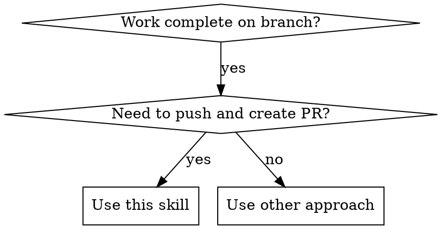

# Create PR with Auto-Squash Merge

## Overview
Efficiently push a branch, create a pull request, and configure auto-squash merge using git and GitHub CLI with proper error handling.

## When to Use



**Use when:**
- Implementation is complete and tested
- You need to push branch to origin
- You need to create a pull request
- You want auto-squash merge configured

**Do NOT use when:**
- Work is still in progress
- You need to draft a PR without auto-merge
- Branch already has an open PR

## Core Pattern

**Before (common mistakes):**
```bash
# ❌ Multiple commands, no error handling
git push origin feature-branch
gh pr create --title "My PR" --body "Description"
gh pr merge --squash --auto  # This merges immediately!
```

**After (correct approach):**
```bash
# ✅ Comprehensive workflow with error handling
./create-pr-with-auto-squash.sh "main" "My PR Title" "PR description"
```

## Quick Reference

| Task | Command |
|------|---------|
| Check branch status | `git status --porcelain` |
| Push if needed | `git push -u origin $(git branch --show-current)` |
| Detect main branch | `git remote show origin | grep 'HEAD branch' | cut -d' ' -f5` |
| Check existing PRs | `gh pr list --head $(git branch --show-current)` |
| Create PR with auto-merge | `gh pr create --base main --title "Title" --body "Body" && gh pr merge --squash --auto` |

## Implementation

```bash
#!/bin/bash
# create-pr-with-auto-squash.sh
set -euo pipefail

# Get current branch
CURRENT_BRANCH=$(git branch --show-current)
BASE_BRANCH="${1:-main}"
TITLE="${2:-$CURRENT_BRANCH}"
BODY="${3:-PR for $CURRENT_BRANCH}"

# 1. Check working tree is clean
if ! git diff --quiet || ! git diff --cached --quiet; then
    echo "❌ Working tree is not clean. Commit or stash changes first."
    exit 1
fi

# 2. Push branch to origin (create upstream if needed)
echo "📤 Pushing branch $CURRENT_BRANCH to origin..."
git push -u origin "$CURRENT_BRANCH"

# 3. Check if PR already exists
if gh pr list --head "$CURRENT_BRANCH" --json number --jq 'length' | grep -q '^[1-9]'; then
    echo "⚠️  PR already exists for branch $CURRENT_BRANCH"
    echo "Existing PRs:"
    gh pr list --head "$CURRENT_BRANCH"
    exit 1
fi

# 4. Auto-detect base branch if not main
if ! git rev-parse --verify "$BASE_BRANCH" >/dev/null 2>&1; then
    BASE_BRANCH=$(git remote show origin | grep 'HEAD branch' | cut -d' ' -f5)
    echo "🔍 Auto-detected base branch: $BASE_BRANCH"
fi

# 5. Create PR with auto-squash merge
echo "🔄 Creating PR: $TITLE"
PR_URL=$(gh pr create \
    --base "$BASE_BRANCH" \
    --title "$TITLE" \
    --body "$BODY")

echo "✅ PR created: $PR_URL"

# 6. Configure auto-squash merge (does NOT merge immediately)
echo "⚙️  Configuring auto-squash merge..."
gh pr merge --squash --auto

echo "🎉 PR configured for auto-squash merge on completion!"
```

## Common Mistakes

| Mistake | Fix |
|---------|-----|
| `gh pr merge --squash` without `--auto` | This merges immediately. Use `--auto` to configure only |
| Not checking for existing PRs | Check with `gh pr list --head <branch>` first |
| Hardcoding main branch | Auto-detect with `git remote show origin` |
| Not verifying clean working tree | Check with `git diff --quiet` before pushing |
| Forgetting `-u` flag on push | Use `git push -u origin` to set upstream tracking |

## Red Flags - STOP and Fix These

- Working tree has uncommitted changes
- Using `gh pr merge` without `--auto` flag
- Multiple PRs exist for same branch
- Branch has no upstream tracking set up

## Error Handling

**Branch not pushed:**
```bash
git push -u origin $(git branch --show-current)
```

**Main branch detection failed:**
```bash
# Try common alternatives
for branch in main master develop; do
    if git rev-parse --verify "$branch" >/dev/null 2>&1; then
        BASE_BRANCH="$branch"
        break
    fi
done
```

**PR creation failed (title exists):**
```bash
# Add branch name to title for uniqueness
TITLE="$TITLE ($CURRENT_BRANCH)"
```